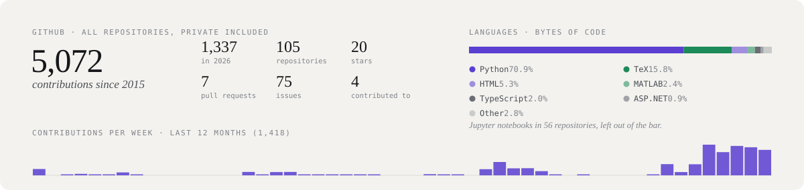

<picture>
  <source media="(prefers-color-scheme: dark)" srcset="assets/banner-dark.svg">
  
</picture>

I'm a computational neuroscientist working between machine learning and vision neuroscience, currently a Guest Research Associate in [Yukiyasu Kamitani's lab](https://kamitani-lab.ist.i.kyoto-u.ac.jp/) at Kyoto University. I did my PhD at the Vision Institute (Sorbonne) and École Normale Supérieure in Paris.

[Website](https://sazio.github.io) · [Google Scholar](https://scholar.google.com/citations?user=ld9Bs6oAAAAJ&hl=en) · [X](https://x.com/simoneazeglio) · [Bluesky](https://bsky.app/profile/s-azeglio.bsky.social) · [LinkedIn](https://www.linkedin.com/in/simoneazeglio) · simone . azeglio at gmail . com

### Research

My work has two sides: building the structure of natural scenes into models of visual neurons, and measuring what information the resulting codes carry.

| | Question | Work |
| --- | --- | --- |
| **Statistics** | What do neighbouring pixels say together? | [Higher-order convolution](https://arxiv.org/abs/2412.06740) (NeurIPS 2025) · [and in the retina](https://arxiv.org/abs/2505.07620) |
| **Symmetry** | How should a code change when the world does? | Scale-equivariant retinal codes support prey hunting ([CoSyNe 2026](https://x.com/simoneazeglio/status/2032039903945449961)) |
| **Information** | Which bits, about what? | [Multi-scale information geometry](https://arxiv.org/abs/2605.06304) (**NeurIPS 2026 Oral**) · [Stimulus-specific information](https://arxiv.org/abs/2505.11309) (NeurIPS 2025 Spotlight) · [Score-based Riemannian metric](https://arxiv.org/abs/2505.11128) |

### Recently

<!-- NEWS:START -->
- **Sep 2026** · [NeurReps 2024 and 2025 proceedings published as PMLR volume 282, which I co-edited](https://proceedings.mlr.press/v282/)
- **Jul 2026** · Defended my PhD thesis at the Vision Institute (Sorbonne) and ENS Paris
- **Mar 2026** · [Co-organizing a workshop on modern efficient coding at CoSyNe 2026](https://x.com/simoneazeglio/status/2032906430097883334)
- **Mar 2026** · [CoSyNe poster 1-146: mouse OFF-α ganglion cells are scale equivariant](https://x.com/simoneazeglio/status/2032039903945449961)
- **Dec 2025** · [NeurReps 2025, our 4th edition, is a wrap](https://x.com/simoneazeglio/status/1998808925509157012)
<!-- NEWS:END -->

Synced daily from [my website](https://sazio.github.io/#news).

### Community

Co-organizer of [NeurReps](https://www.neurreps.org/) at NeurIPS (2022–2025), [ECMA](https://sites.google.com/view/ecma-cosyne/home) at CoSyNe 2026, [Sharpening Our Sight](https://sites.google.com/view/cosyne2024-sos/home) at CoSyNe 2024 and [SINR](https://sazio.github.io/workshops/sinr/) at Bernstein (2022–2023). Co-founder of the [Machine Learning Journal Club](https://www.mljc.it/). Before the PhD: Flatiron Institute, Institut Pasteur, CERN and the University of Ottawa.

Always glad to talk about collaborations, and to mentor students whose interests line up with these topics.

<picture>
  <source media="(prefers-color-scheme: dark)" srcset="assets/stats-dark.svg">
  
</picture>

The banner is generated by [`scripts/make_banner.py`](scripts/make_banner.py): OFF and ON ganglion-cell mosaics with difference-of-Gaussians receptive fields, the same model as the header of my website. The activity card is refreshed daily by [`scripts/make_stats.py`](scripts/make_stats.py).
